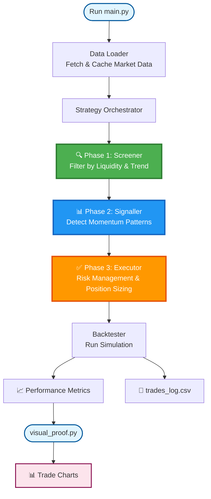
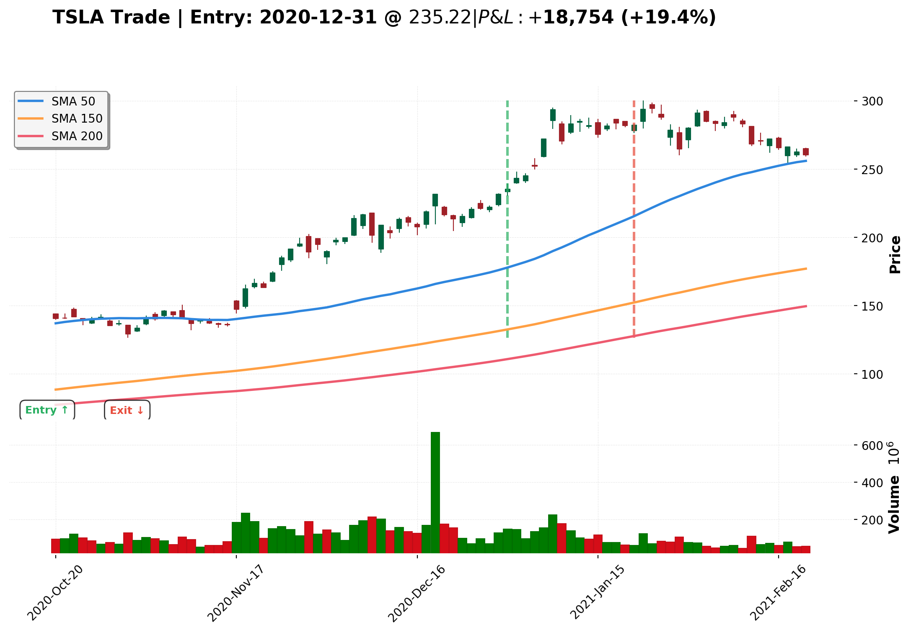

## Systematic Momentum Trading System



### 1. Professional Architecture
The system is designed as a modular Python package (`momentum_system`) with a three-phase architecture:

*   **Three-Phase Module Structure**:
    *   **`screener/`** (`screener/filters.py`): Applies liquidity and trend filters to identify tradeable candidates
    *   **`signaller/`** (`signaller/signals.py`): Detects momentum patterns (Riser/Tread/VCP) and generates entry/exit signals
    *   **`executor/`** (`executor/risk.py`): Handles risk management (ATR-based stops, position sizing with Fixed/Kelly methods)
    *   `strategy.py`: Orchestrates the three phases via `MomentumStrategy`
    *   `backtester.py`: Runs the simulation and performance analysis

*   **Common Components** (`common/`):
    *   `data_loader.py`: Handles yfinance API with local caching
    *   `indicators.py`: Vectorized technical indicators (SMA, ATR, ROC)
    *   `config.py`: Centralized parameter configuration and universe definition
    *   `logger_setup.py`: Structured logging with latency measurement
    *   `visualizer.py`: Trade chart generation with technical overlays

*   **Entry Points**:
    *   `main.py`: Runs full backtest and outputs performance metrics
    *   `visual_proof.py`: Generates visual chart for the best performing trade

*   **Type Safety & Logging**: Extensive use of Python Type Hints (`Dict[str, pd.DataFrame]`) and standard `logging` ensures maintainability 

### 2. Usage

```bash
# Run backtest and view performance metrics
python main.py

# Generate visual proof chart for best trade
python visual_proof.py
```

Results:
- Performance metrics printed to console
- Trading log saved to `trades_log.csv`
- Trade visualizations saved to `charts/` directory

### 3. Latency & Performance Analysis
The system balances development speed with execution performance.

*   **Vectorized Indicators**: `numpy` and `pandas` vectorized operations are used for all signal generation (SMA, ROC, Rolling Max). This avoids slow Python loops for math.
*   **The "Pandas Iteration" Bottleneck**:
    *   *Issue*: The backtester iterates daily over the universe to manage portfolio state (Cash/Positions). While slower than pure vectorization (`df * signal`), it is necessary for realistic path-dependent simulation (e.g., stopping out mid-week, compounding equity).
    *   *Mitigation*: We iterate over a unified date index rather than nested loops over every ticker every day unnecessarily. For a universe of <500 stocks, this Python loop is negligible (sub-second). For HFT, we would move this loop to C++ (via Cython) or Numba.

## 4. Failure Scenarios & Risk

### Look-Ahead Bias
*   **Risk**: Calculating signals using the `Close` of the current day to trade on the *same* day's Open or High.
*   **Mitigation**: The system carefully uses `.shift(1)` for all setup conditions. However, the breakout trigger `Close > Pivot` uses the current candle. A strictly realistic simulation would assume execution at the *next* available price (Next Open) or use Intraday data to verify *when* the breakout occurred. Using Daily Close implies we sit at the screen at 3:59 PM and buy if condition is met.

### Market Impact & Liquidity
*   **Risk**: The system assumes infinite liquidity at the `Close` price. For large positions in thin stocks ("High Tight Flags" can be illiquid small caps), buying 10,000 shares might push the price up 5% (Slippage).
*   **Mitigation**: The `data_loader` currently filters `Volume > 0`. A production upgrade would filter for `Dollar Volume > $20M` and limit position size to `< 1% of Daily Volume`.

## 5. Unaddressed Constraint
*   **Dividends/Splits**: `yfinance(auto_adjust=True)` handles this mostly, but a rigorous system needs a dedicated Corporate Actions handler to ensure stops aren't triggered falsely by a split.

## 6. Visual Example

The system includes a visualization module that generates detailed trade charts showing entry/exit points, SMAs, and ATR-based stop losses.



